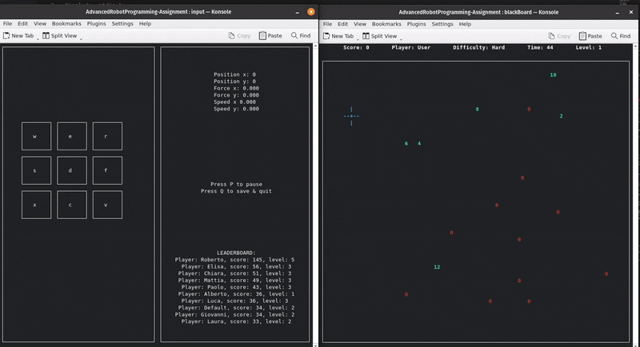
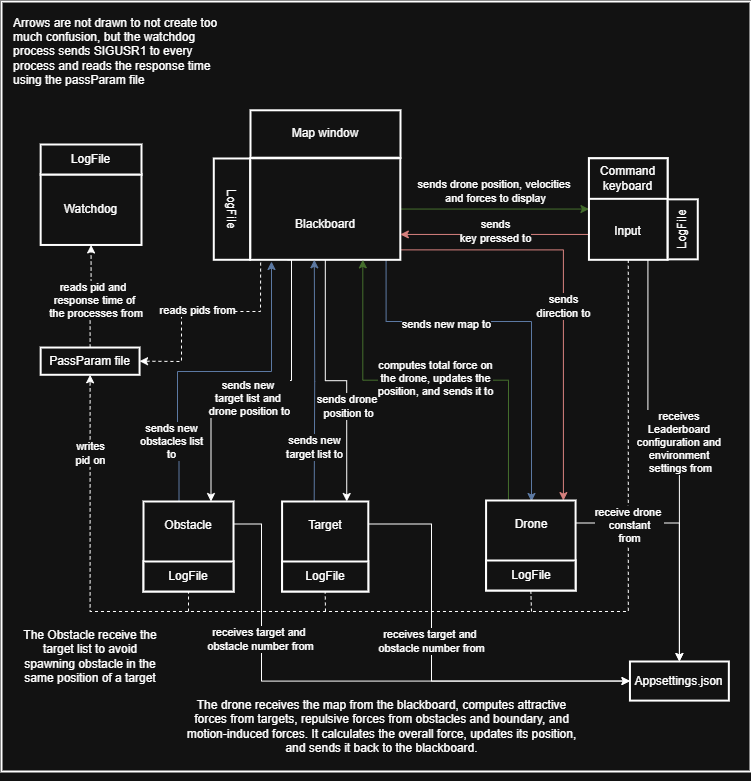
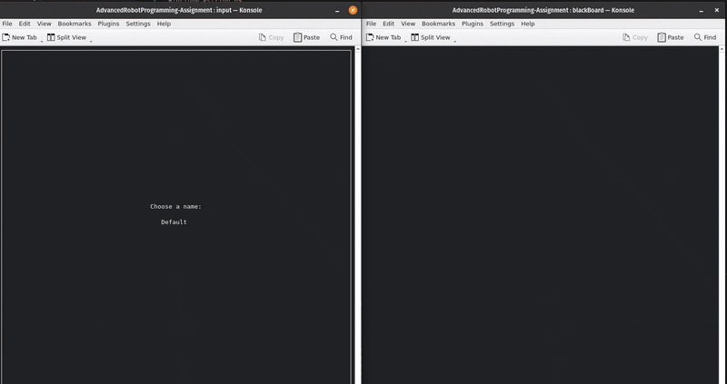

# Advanced & Robot Programming Assignment

## Description
This repository is the delivery of the first assignment of the Advanced and Robot Programming course. The project, implemented in C, simulates a drone moving in a 2D space to reach targets in the environment while avoiding obstacles. The GUI is implemented using ncurses, and communication between processes is via pipes and signals. 



## Installation Instructions and Requirements
To set up the project, follow these steps:
1. Clone the repository: ```git@github.com:MattiaTinfena/AdvancedRobotProgramming-Assignment.git ```
2. Make the installation script executable: ```chmod +x install.sh ```
3. Run the script: ```./install.sh```

The `install.sh` scripts automates the installation of required dependencies for the project and performs the following actions:
1. Updates the package lists and upgrades installed packages.
2. Installs necessary terminal emulators (Terminator and Konsole).
3. Installs development libraries for ncurses and cJSON.
4. Cleans up previous build files and compiles the project.


## Usage and Recompilation
After installation, you can run the project using one of the following methods:
- Direct execution: ``` ./bin/main```
- Using the vscode environment with the launch.json file provided in the .vscode folder.

If some changes are made to the code, it is necessary to run the make command to recompile the project before running it. Otherwise, you can use the "Run Code" if you are using vscode.

However, when compiling with VS Code, some issues cause the window to resize incorrectly. To resolve this, it is advisable to run ```make clean``` followed by ```make``` from terminal.

## Project Architecture
The project architecture of the assignment includes 6 active components, a parameter file ("appsettings.json"), and a log folder ("log") for all log files. 



### Blackboard
The blackboard serves as the central communication center between components:

- Receives target and obstacle positions from their respective components.
- Sends target and obstacle positions to the drone and receives drone position updates and applied forces.
- Processes user input and forwards it to the drone component for position updates.

Additionally, the blackboard:
- Displays a real-time map of the environment, showing the drone, targets, and obstacles;
- Displays the score, the player's name, the difficulty, the time remaining and the level;
- Computes an overall score based on  number of targets and difficulty.


The primitives of the blackboard are the following:
- File Manipulation: Functions like fopen(), fwrite(), and fclose() are used to open a log file, write messages, and close it.
- flock() used in the function writeSecure() manages file locking:
    - LOCK_EX for exclusive write access.
    - LOCK_SH for shared read access.
    - LOCK_UN to unlock the file.
- Process Management and Signal Handling:
    - getpid(), which retrieves the process ID.
    - sigaction() handles signals from the watchdog (SIGUSR1), manages termination cleanup (SIGTERM), and detects window resizing (SIGWINCH).
    - kill() allows you to safely shut down all processes.
    - sigset_t mask ensures safe signal handling with pselect().
- Interprocess Communication (IPC) via Pipes:
    - write() and read() facilitate data exchange between processes in writeMsg(), writeInputMsg(), readMsg() and readInputMsg().
- UI Handling with Ncurses:
    - initscr(), start_color(), curs_set(), noecho(), cbreak() configure input and display settings.
    - getmaxyx() retrieves terminal size for dynamic UI.
    - newwin(), box(), wrefresh(), mvwprintw(), and werase() manage windows and content rendering.
- Configuration & JSON Parsing:
    - cJSON_Parse(), cJSON_GetObjectItemCaseSensitive(), cJSON_Print(), and cJSON_Delete() handle reading, modifying, and freeing configuration data.

readMsg() and writeMsg() facilitate IPC via pipes by reading and writing a Message structure, logging errors, and terminating on failure. readInputMsg() and writeInputMsg() do the same but with an inputMessage structure.


### Watchdog
The watchdog continuously monitors system activity, detecting inactivity and triggering alerts when no computations occur. If necessary, it can stop the system to maintain proper functionality. It periodically sends a SIGUSR1 signal to all monitored processes to verify their responsiveness. If a process fails to respond, the watchdog logs the issue and terminates all the process.


The watchdog utilizes the following primitives:
- File Manipulation: Functions like fopen(), fwrite(), and fclose() are used to open a log file, write messages, and close it.
- Process Management and Signal Handling:
    - kill(): used to send a signal
    - getpid(): used to get the process ID of the watchdog and write it on the passParam file.
    - Sigaction(): used to initialize the signal handler to handle the signal sent by the watchdog.

In addition to those, writeSecure() and readSecure() are custom functions designed for safe file operations. writeSecure() allows for writing or modifying a specific line in a file while ensuring that no two processes modify it simultaneously. Meanwhile, readSecure() reads a specific line while maintaining safe concurrent access.

#### Passparam file
The passparam file is used from the various process to write their process id so that the watchdog is able to read them and send them a signal to check if they are still running.

### Input
The input handles user input and displays relevant information using the ncurses library, including:

- The leaderboard
- The drone's position and speed
- The forces acting on the drone

The starting leaderboard is read from the "appsettings.json" file and updated at the end of the game when the user decides to save and close the game.

Upon startup, the user selects:
- The player's name;
- A key configuration between the default one and a custom one;
- A difficulty level between easy and difficult.



In easy mode, the map remains static, while in hard mode, it dynamically changes every few seconds, awarding double points.

After the user has selected the options, the game starts, and the user can control the drone using the key configuration of its choice. The eight external keys can be used to move the drone by adding a force in the respective direction. On the other hand, the central key is used to instantly zero all the forces, in order to see the inertia on the drone.

In addition, the user can choose to pause the game at any time by pressing the 'p' key, or to quit the game by pressing the 'q' key. Other keys pressed are ignored.

The input utilizes the following primitives:

- File Manipulation: fopen(), fwrite(), and fclose() to open, write, and close log files.
- flock() used in the function writeSecure() manages file locking:
    - LOCK_EX for exclusive write access.
    - LOCK_SH for shared read access.
    - LOCK_UN to unlock the file.
- Process Management & Signal Handling:
    - getpid(), which retrieves the process ID.
    - sigaction() handles signals from the watchdog (SIGUSR1), manages termination cleanup (SIGTERM), and detects window resizing (SIGWINCH).
- Interprocess Communication (IPC) via Pipes: write() and read() facilitate data exchange between processes.
- UI Handling with Ncurses:
    - initscr(), start_color(), curs_set(), noecho(), cbreak(), and nodelay() configure input and display settings.
    - getmaxyx() retrieves terminal size for dynamic UI.
    - newwin(), box(), wrefresh(), mvwprintw(), and werase() manage windows and content rendering.
- Configuration & JSON Parsing:
    - cJSON_Parse(), cJSON_GetObjectItemCaseSensitive(), cJSON_Print(), and cJSON_Delete() handle reading, modifying, and freeing configuration data.

In addition, writeSecure() and readSecure() ensure safe file operations. writeSecure() modifies a specific line while preventing concurrent writes, and readSecure() reads a line with safe shared access. Lastly, readInputMsg() and writeInputMsg() facilitate IPC via pipes by reading and writing the InputMessage structure, logging errors, and terminating on failure.


### Target and Obstacle
The target and obstacle processes function similarly, generating random positions within the environment while ensuring they are not too close to the drone or to the other elements of the same type. These positions are then sent to the blackboard for display and processing. Additionally, obstacles are strategically placed to avoid being too close to targets, allowing the drone to reach all the targets without any issues.

The target and obstacle utilize the following primitives:
- File Manipulation: Functions like fopen(), fwrite(), and fclose() are used to open a log file, write messages, and close it.
- flock() used in the function writePid() manages file locking:
    - LOCK_EX for exclusive write access.
    - LOCK_SH for shared read access.
    - LOCK_UN to unlock the file.
- Process Management and Signal Handling:
    - writePid(), which retrieves the process ID using getpid().
    - sigaction() handles signals from the watchdog (SIGUSR1), manages termination cleanup (SIGTERM).
- Interprocess Communication (IPC) via Pipes:
    - write() and read() facilitate data exchange between processes.
- Configuration & JSON Parsing:
    - cJSON_Parse(), cJSON_GetObjectItemCaseSensitive(), cJSON_Print(), and cJSON_Delete() handle reading, modifying, and freeing configuration data.

In addition, readMsg() and writeMsg() facilitate IPC via pipes by reading and writing the Message structure, logging errors, and terminating on failure.


### Drone
The drone handles movement and interaction with targets and obstacles, using force-based navigation. The formula used to calculate the next position of the drone is the following:

$$ x_i = \frac {2m\cdot x_{i-1} + Tk \cdot x_{i-1} + F_x \cdot T^2 - m \cdot x_{i-2}}{m + Tk} $$

where:
- $m$ is the drone's mass
- $x_{i - 1}$ and $x_{i-2}$ are the drone's position respectivelly at istance $i-1$ and istance $i-2$
- $T$ is the period
- $k$ is the viscous costant
- $F_x$ is the sum of all the forces in that given direction

For the y coordinate the formula is the same. Analyzing how the total force acting on the drone was calculated, this is given by:
- User input, where each key pressed adjusts the force vector by increasing the corresponding force applied to the drone.
- Repulsive force from the obstacles;

$$ F_{rep} = \begin{cases} \eta \cdot \left(\frac{1}{\rho(q)} - \frac{1}{\rho_0} \right) \frac{1}{\rho^2(q)}\nabla\rho(q), & \text{if } \rho(q) \leq \rho_0\\  0, & \text{if} \rho(q) > \rho_0 \end{cases} $$

where $\eta$ is is a positive scaling factor, $\rho$ is the distance between the single obstacle and the drone and $\rho_0$ is the threshold above which the obstacle has no influence.
- Attractive force from the targets.

$$ F_{att} = - \psi \frac{(q - q_{goal})}{||q-q_{goal}||} $$

where $\psi$ is a positive scaling factor, $q_{goal}$ is the target position and $q$ is the drone position. 

The drone utilizes the following primitives:
- File Manipulation: Functions like fopen(), fwrite(), and fclose() are used to open a log file, write messages, and close it.
- flock() used in the function writePid() manages file locking:
    - LOCK_EX for exclusive write access.
    - LOCK_SH for shared read access.
    - LOCK_UN to unlock the file.
- Process Management and Signal Handling:
    - writePid(), which retrieves the process ID using getpid().
    - Sigaction() used to initialize the signal handler to handle the signal sent by the watchdog
- Interprocess Communication (IPC) via Pipes:
    - write() and read() facilitate data exchange between processes in writeMsg() and readMsg().
- Configuration & JSON Parsing:
    - cJSON_Parse(), cJSON_GetObjectItemCaseSensitive(), cJSON_Print(), and cJSON_Delete() handle reading, modifying, and freeing configuration data.

In particular, writeSecure() ensure safe file operations, allowing to modify a specific line while preventing concurrent writes. Lastly, readMsg() and writeMsg() facilitate IPC via pipes by reading and writing a Message structure, logging errors, and terminating on failure.

## Parameter Management
All configurable parameters are stored in the appsettings.json file and can be modified. These parameters include:
- Player Settings: Player name, difficulty level, and default key bindings, which can be customized at the start of the game.
- Game Progression: Initial level and time per level.
- Environment Settings: Number of targets and obstacles, determining the density of entities in each level.
- Level Scaling: Incremental increase in targets and obstacles as the game progresses.
- Leaderboard: Player rankings, which are updated at the end of each game session.
## Logging
Logs are available to assist developers in debugging the project and to provide users with insights into the execution process. Each component generates its own log file, storing relevant information, all of which are located in the logs folder. 
The level of detail in the logs varies based on the project's build mode. In debug mode, more detailed information is recorded, while in release mode, logging is minimized. This behavior is controlled by the USE_DEBUG flag and developed using MACROS.

## Project structure
```
📂 NomeRepository  
│── 📄 Makefile  
│── 📄 appsettings.json  
│── 📄 README.md  
│── 📂 docs/  
│   ├── 🖼️ ARP-ass1.png  
│   ├── 🎞️ Game.gif  
│   ├── 🎞️ menu.gif  
│  
│── 📂 cJSON/  
│   ├── 📄 cJSON.h  
│  
│── 📂 include/  
│   ├── 📄 auxfunc.h  
│   ├── 📄 drone.h  
│   ├── 📄 input.h  
│   ├── 📄 keyboardMap.h  
│   ├── 📄 log.h  
│   ├── 📄 obstacle.h  
│   ├── 📄 target.h  
│   ├── 📄 watchdog.h  
│  
│── 📂 src/  
│   ├── 📄 auxfunc.c  
│   ├── 📄 blackBoard.c  
│   ├── 📄 drone.c  
│   ├── 📄 input.c  
│   ├── 📄 main.c  
│   ├── 📄 obstacle.c  
│   ├── 📄 target.c  
│   ├── 📄 watchdog.c  
│  
│── 📄 install.sh*  
```